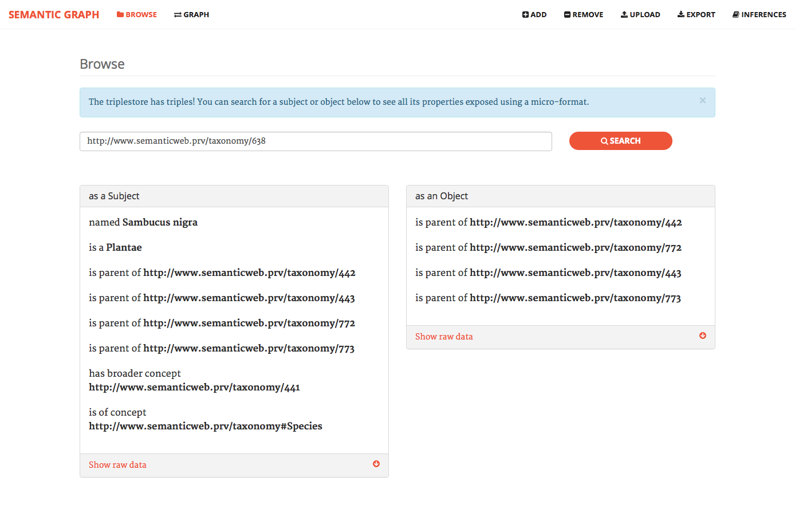

# Semantic Graph

Django application for semantic search using RDF standards.

It implements graph visualisation with GraphViz and data inference with SPARQL queries, and supports reading and writing of N-Triples, N3 and RDF/XML documents.

Additionally, data is stored in Sesame triple store following a Protégé ontology specification.


## Screenshots




## How to run

[Download the latest release](https://github.com/edduarte/semantic-graph/releases) and run the following command:

```
python manage.py runserver
```

The app will be deployed to http://127.0.0.1:8000/, which you can access from a browser. You can then add triples manually or import a RDF file in the N-Triples, N3 or XML format.


